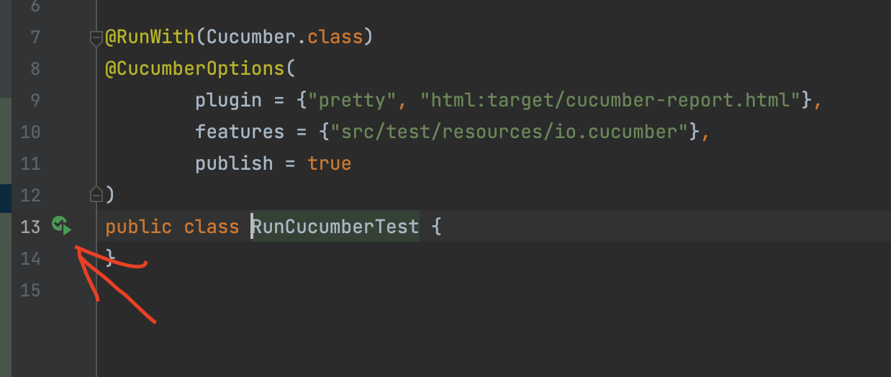
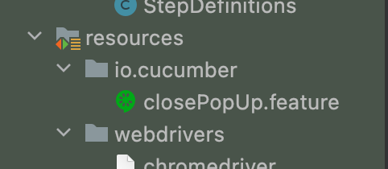
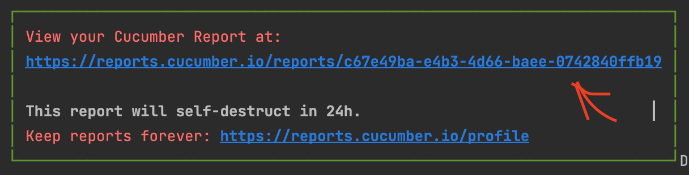
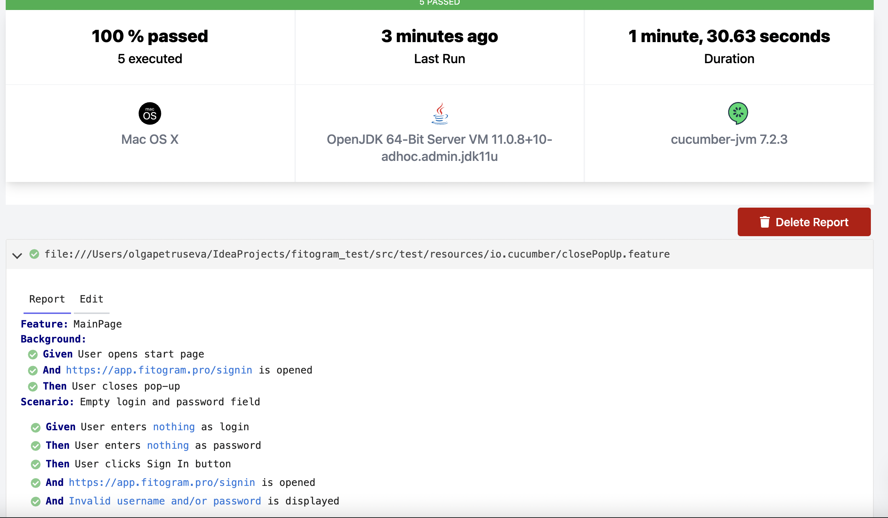
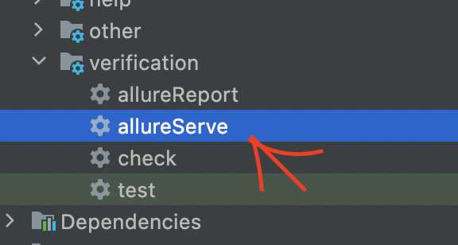
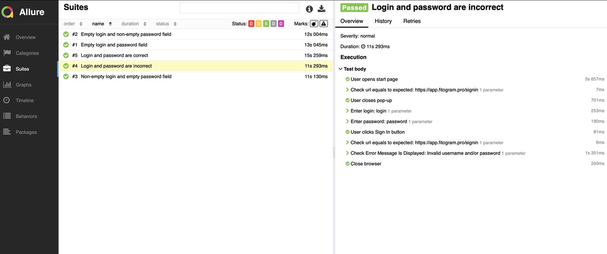

Here is the project for the test task

I decided to use Allure report + Cucumber report.
To run tests please clone the project and press the buttons (see the screenshot below)

I've created 5 scenarios to test Fitogram Pro Authorization.
You can see it in closePopUp.feature

I used Java, Cucumber, Selenium, Junit5, Allure, Gradle, Chromedriver for browser Chrome(99.0.4844.74)

If my Chromedriver is not suitable for your system and/or browser version 
please download the correct item https://chromedriver.chromium.org/downloads
(or you can see screenshots below)

After running a test/group of tests you can generate report (automatically).

To see Cucumber Report click the link in console:

Run AllureServe to look through the results with alternative instrument (screenshot below)

